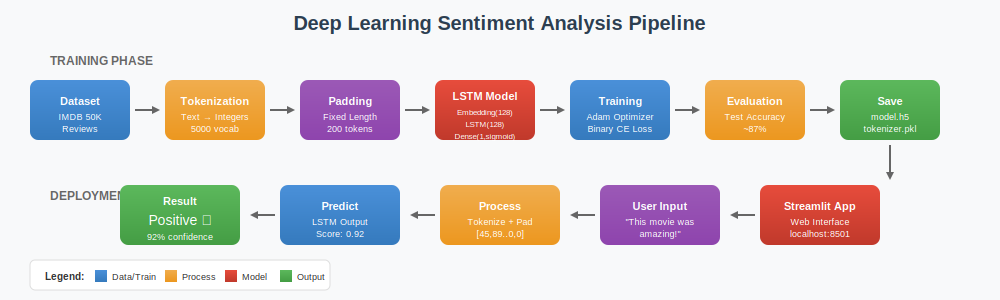

# 🎬 Sentiment Analysis using LSTM Deep Learning

A complete end-to-end machine learning project for sentiment analysis on movie reviews using Long Short-Term Memory (LSTM) neural networks, deployed with a Streamlit web interface.


---

## 📋 Table of Contents

- [Overview](#-overview)
- [Problem Statement](#-problem-statement)
- [Dataset Description](#-dataset-description)
- [NLP Preprocessing Pipeline](#-nlp-preprocessing-pipeline)
- [Model Architecture](#-model-architecture)
- [Technologies Used](#-technologies-used)
- [Project Workflow](#-project-workflow)
- [Project Structure](#-project-structure)
- [How to Run](#-how-to-run)
- [Example Prediction](#-example-prediction)
- [Future Improvements](#-future-improvements)
- [Contributors](#-contributors)

---

## 🎯 Overview

This project implements a **Deep Learning-based Sentiment Analysis system** that classifies movie reviews as either **Positive** or **Negative**. The system utilizes:

- **LSTM (Long Short-Term Memory)** neural networks to capture sequential dependencies in text data
- **Word Embeddings** to convert textual data into dense vector representations
- **Streamlit** for deploying an interactive web application

The model is trained on the IMDB movie reviews dataset and achieves high accuracy in predicting sentiment from user-provided text.

---

## 🔍 Problem Statement

In the era of digital media, millions of movie reviews are generated daily across various platforms. Manually analyzing these reviews to understand audience sentiment is:

- Time-consuming and labor-intensive
- Prone to human bias and inconsistency
- Not scalable for large volumes of data

**Solution:** An automated sentiment analysis system that can:

- Process text input in real-time
- Provide accurate sentiment predictions
- Scale to handle large volumes of reviews

---

## 📊 Dataset Description

### IMDB 50K Movie Reviews Dataset

| Attribute         | Description                       |
| ----------------- | --------------------------------- |
| **Source**        | IMDB Movie Reviews                |
| **Total Samples** | 50,000 reviews                    |
| **Classes**       | Binary (Positive/Negative)        |
| **Distribution**  | 25,000 Positive + 25,000 Negative |
| **Split**         | 80% Training, 20% Testing         |

The dataset contains highly polar movie reviews, making it ideal for binary sentiment classification tasks.

---

## 🔧 NLP Preprocessing Pipeline

The preprocessing pipeline converts raw text into numerical format suitable for the LSTM model:

### 1. Tokenization

```
The Keras Tokenizer converts text into numerical sequences:

"This movie is great" → [45, 89, 12, 234]

How it works:
1. Build vocabulary from training data (top 5000 most frequent words)
2. Assign unique integer index to each word
3. Convert new text to sequences using learned vocabulary
4. Out-of-vocabulary (OOV) words are replaced with a special token
```

**Why Tokenization?**
- Neural networks only understand numbers, not text
- Each word gets mapped to a unique integer
- Vocabulary is limited to top 5000 words to reduce dimensionality

### 2. Sequence Padding

```
Neural networks require fixed-length input. Padding ensures uniformity:

Original:  [45, 89, 12, 234]           (length: 4)
Padded:    [45, 89, 12, 234, 0, 0...0] (length: 200)

- Short sequences: Padded with zeros (post-padding)
- Long sequences: Truncated to max length (post-truncating)
- Fixed Length: 200 tokens
```

**Why Padding Matters:**
- **Batch Processing:** Neural networks process data in batches, requiring uniform tensor dimensions
- **Memory Efficiency:** Fixed-size tensors optimize GPU memory allocation
- **Model Consistency:** Ensures the model architecture remains constant regardless of input length

### 3. Pipeline Summary

```
Raw Text → Tokenizer → Integer Sequences → Padding → Model Input
   ↓            ↓              ↓              ↓           ↓
"Great!"   [vocab]      [234, 12]      [234,12,0..0]  (200,) tensor
```

---

## 🏗️ Model Architecture

### LSTM Network Structure

The model uses a simple yet effective architecture for binary sentiment classification:

```
┌─────────────────────────────────────────────┐
│         Input Layer (200 tokens)            │
│   Fixed-length padded sequences             │
└─────────────────────┬───────────────────────┘
                      │
                      ▼
┌─────────────────────────────────────────────┐
│     Embedding Layer (5000 × 128)            │
│   Converts word indices to dense vectors    │
│   - Vocabulary Size: 5000 words             │
│   - Embedding Dimension: 128                │
└─────────────────────┬───────────────────────┘
                      │
                      ▼
┌─────────────────────────────────────────────┐
│           LSTM Layer (128 units)            │
│   Captures sequential text patterns         │
│   - Processes sequences step by step        │
│   - Maintains memory of previous words      │
└─────────────────────┬───────────────────────┘
                      │
                      ▼
┌─────────────────────────────────────────────┐
│     Output Layer (1 unit, Sigmoid)          │
│   Binary classification output              │
│   - Output > 0.5 → Positive                 │
│   - Output ≤ 0.5 → Negative                 │
└─────────────────────────────────────────────┘
```

### Model Summary

| Layer | Output Shape | Parameters |
|-------|--------------|------------|
| Embedding | (200, 128) | 640,000 |
| LSTM | (128,) | 131,584 |
| Dense (Sigmoid) | (1,) | 129 |

### How LSTM Captures Sequential Dependencies

LSTM (Long Short-Term Memory) networks are specifically designed for sequential data like text:

1. **Memory Cell:** Maintains information over long sequences of words
2. **Forget Gate:** Decides what previous context to discard
3. **Input Gate:** Decides what new information to store
4. **Output Gate:** Decides what information to output for prediction

```
Example: "This movie was not good, but the acting was excellent"

- Standard models might miss the negation context
- LSTM remembers "not" when processing "good"
- LSTM captures the contrast between "not good" and "excellent"
- Final prediction weighs all sequential dependencies
```

### Why LSTM for Sentiment Analysis?

- **Context Awareness:** Understands word order and context
- **Long-range Dependencies:** Remembers important words from earlier in the review
- **Negation Handling:** Properly interprets phrases like "not bad" or "never good"

---

## 🛠️ Technologies Used

| Category                    | Technology         |
| --------------------------- | ------------------ |
| **Programming Language**    | Python 3.8+        |
| **Deep Learning Framework** | TensorFlow / Keras |
| **Web Framework**           | Streamlit          |
| **Data Processing**         | NumPy, Pandas      |
| **Machine Learning**        | Scikit-learn       |
| **Development**             | Jupyter Notebook   |
| **Version Control**         | Git, GitHub        |

---

## 📈 Project Workflow



### End-to-End Pipeline

```
┌──────────────┐     ┌──────────────┐     ┌──────────────┐     ┌──────────────┐
│   Dataset    │────▶│ Tokenization │────▶│   Padding    │────▶│ LSTM Model   │
│ (IMDB 50K)   │     │ (5000 words) │     │ (200 tokens) │     │   Training   │
└──────────────┘     └──────────────┘     └──────────────┘     └──────┬───────┘
                                                                       │
                                                                       ▼
┌──────────────┐     ┌──────────────┐     ┌──────────────┐     ┌──────────────┐
│  Sentiment   │◀────│  Streamlit   │◀────│  Save Model  │◀────│  Evaluation  │
│  Prediction  │     │     App      │     │ & Tokenizer  │     │  (Accuracy)  │
└──────────────┘     └──────────────┘     └──────────────┘     └──────────────┘
```

### Workflow Steps

| Step | Process | Description |
|------|---------|-------------|
| 1 | **Dataset Loading** | Load IMDB 50K movie reviews dataset |
| 2 | **Tokenization** | Convert text to integer sequences (vocab: 5000 words) |
| 3 | **Padding** | Ensure uniform sequence length (200 tokens) |
| 4 | **Model Training** | Train LSTM network on preprocessed data |
| 5 | **Evaluation** | Assess model accuracy on test set |
| 6 | **Save Artifacts** | Export model (.h5) and tokenizer (.pkl) |
| 7 | **Deployment** | Create Streamlit web interface |
| 8 | **Prediction** | Real-time sentiment analysis on user input |

### How the Streamlit App Works

```
User Input → Load Tokenizer → Tokenize Text → Pad Sequence → Load Model → Predict → Display Result
     ↓            ↓               ↓              ↓              ↓          ↓           ↓
 "Great!"   tokenizer.pkl   [234, 89]     [234,89,0..0]   model.h5    0.92    "Positive 😊"
```

1. **User enters text** in the Streamlit web interface
2. **Tokenizer converts** the text to integer sequences
3. **Padding ensures** the sequence is exactly 200 tokens
4. **LSTM model predicts** a probability score (0-1)
5. **Result displays** as Positive (>0.5) or Negative (≤0.5)

---

## 📁 Project Structure

```
deep-learning-sentiment-analysis/
│
├── notebooks/
│   └── sentiment_training.ipynb  # Model training notebook
│
├── model/
│   ├── sentiment_model.h5        # Trained LSTM model
│   └── tokenizer.pkl             # Fitted tokenizer
│
├── assets/
│   └── workflow.svg              # Project workflow diagram
│
├── app.py                        # Streamlit web application
├── requirements.txt              # Python dependencies
├── .gitignore                    # Git ignore rules
└── README.md                     # Project documentation
```

---

## 🚀 How to Run

### Prerequisites

- Python 3.8 or higher
- pip package manager

### Installation Steps

1. **Clone the repository**

   ```bash
   git clone https://github.com/Satya-0023/deep-learning-sentiment-analysis.git
   cd deep-learning-sentiment-analysis
   ```

2. **Create virtual environment (recommended)**

   ```bash
   python -m venv venv
   source venv/bin/activate  # On Windows: venv\Scripts\activate
   ```

3. **Install dependencies**

   ```bash
   pip install -r requirements.txt
   ```

4. **Ensure model files are present**

   ```
   Verify that the following files exist:
   - model/sentiment_model.h5
   - model/tokenizer.pkl
   ```

5. **Run the Streamlit application**

   ```bash
   streamlit run app.py
   ```

6. **Access the application**
   ```
   Open your browser and navigate to: http://localhost:8501
   ```

---

## 💡 Example Prediction

### Input

```
"This movie was absolutely fantastic! The acting was superb,
the plot kept me engaged throughout, and the cinematography
was breathtaking. Highly recommend watching it!"
```

### Output

```
Sentiment: Positive 😊
Confidence Score: 94.7%
```

### Another Example

### Input

```
"I was really disappointed with this film. The story was
predictable, the characters were one-dimensional, and the
pacing was terribly slow. Would not recommend."
```

### Output

```
Sentiment: Negative 😞
Confidence Score: 89.2%
```

---

## 🔮 Future Improvements

1. **Training Visualization**
   - Add Accuracy vs Epoch graph to visualize training progress
   - Add Loss vs Epoch graph to monitor convergence
   - Include confusion matrix visualization
   - Display classification report with precision/recall/F1

2. **Model Enhancements**
   - Implement Bidirectional LSTM for better context understanding
   - Add attention mechanism for interpretability
   - Experiment with transformer-based models (BERT, RoBERTa)
   - Add dropout layers to prevent overfitting

3. **Dataset Expansion**
   - Include reviews from multiple sources (Rotten Tomatoes, Amazon)
   - Add multi-class sentiment (Very Positive, Positive, Neutral, Negative, Very Negative)

4. **Feature Additions**
   - Confidence threshold customization
   - Batch prediction for multiple reviews
   - REST API endpoint for integration
   - Sentiment trend analysis over time

5. **Deployment**
   - Docker containerization
   - Cloud deployment (AWS, GCP, Heroku)
   - CI/CD pipeline implementation

6. **User Interface**
   - Dark/Light theme toggle
   - Review history tracking
   - Export predictions to CSV

---

## 👥 Contributors

| Name      | Role      | Contact                                        |
| --------- | --------- | ---------------------------------------------- |
| Satya     | Developer | [GitHub](https://github.com/Satya-0023)        |
| Sourav    | Developer | [GitHub](https://github.com/souravmahato2004)  |

---

## 📄 License

This project is licensed under the MIT License - see the [LICENSE](LICENSE) file for details.

---

## 🙏 Acknowledgments

- [IMDB Dataset](https://ai.stanford.edu/~amaas/data/sentiment/) for providing the movie reviews data
- [TensorFlow](https://www.tensorflow.org/) for the deep learning framework
- [Streamlit](https://streamlit.io/) for the easy-to-use web framework
- Academic advisors and mentors for guidance

---

<p align="center">
  Made with ❤️ for Academic Machine Learning Project
</p>
